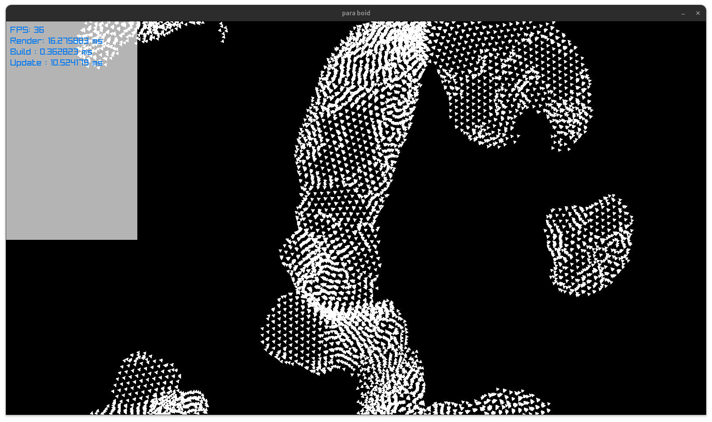
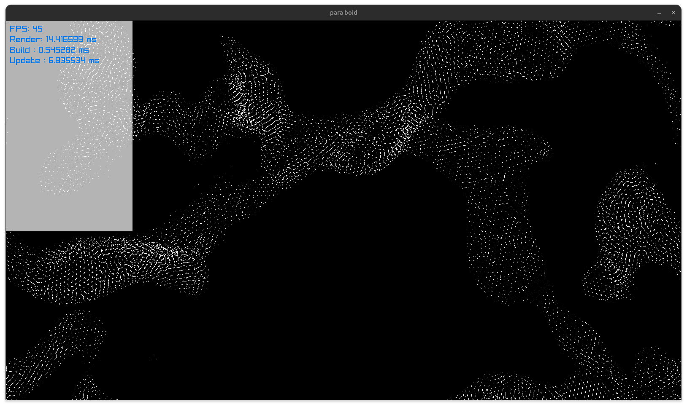

# para-boids


A boids (flocking) simulation used as a playground for multi-threading and SIMD in C.

The real goal isn't the boids themselves — it's using them as a concrete, visual workload
to experiment with writing multi-threaded-by-default programs, in the spirit of
Casey Muratori and Ryan Fleury's article on multi-threading by default. The simulation
is split into per-thread "lanes" from the start (not bolted on after the fact), synchronized
with a hand-rolled sense-reversing barrier, with each thread working out of its own
arena carved from a single reserved block of virtual memory.

SIMD is the next layer being explored on top of that: restructuring the boid/grid data
so the per-boid neighbor search can be vectorized, instead of just relying on
thread-level parallelism alone.

## Status

The data layout work needed for SIMD is done: boid positions/velocities live in flat
SoA arrays, the spatial grid is a contiguous CSR-style layout instead of a pointer-chased
linked list, and the grid rebuild physically sorts the boid data into cell order (double
buffered) so a cell's neighbors are a contiguous run in memory rather than a gather.

Before writing the actual vectorized code, the frame is instrumented with a per-phase
timer (render / grid build / update, each shown on screen in milliseconds) so any SIMD
work can be measured against a real baseline instead of guessed at:



The neighbor search inside `update()` is now AVX2-vectorized: for each boid, the
grid's per-cell boid runs (already contiguous thanks to the sorted layout above) are
scanned 8-at-a-time, with the three cells in a grid row merged into a single range
before vectorizing, since they're contiguous by construction. Per-thread update time
dropped from ~24-28ms to ~5ms with this in place, at a boid count that's also grown
from 20k to 50k in the process:



## Layout

- `main.c` — the boids simulation: update/render loop, flocking rules (separation,
  alignment, cohesion), spatial grid for neighbor lookups, and the thread/lane setup.
- `util.c` — the memory allocator: a `Reserve` (a large `mmap`'d virtual address space)
  that hands out page-aligned `Arena` sub-regions, with pages committed lazily as
  objects are actually allocated.
- `thread.c` — early scratch work for a generic threading abstraction, kept around from
  before the lane/barrier design in `main.c` existed.

## Building

```bash
./build.sh
./main
```

Requires [raylib](https://www.raylib.com/) and pthreads.
