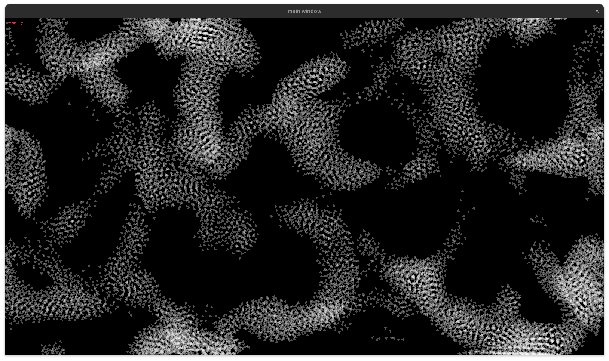

# para-boids



A boids (flocking) simulation used as a playground for multi-threading and SIMD in C.

The real goal isn't the boids themselves — it's using them as a concrete, visual workload
to experiment with writing multi-threaded-by-default programs, in the spirit of
Casey Muratori and Ryan Fleury's article on multi-threading by default. The simulation
is split into per-thread "lanes" from the start (not bolted on after the fact), synchronized
with a hand-rolled sense-reversing barrier, with each thread working out of its own
arena carved from a single reserved block of virtual memory.

SIMD is the next layer being explored on top of that: restructuring the boid/grid data
so the per-boid neighbor search can be vectorized, instead of just relying on
thread-level parallelism alone.

## Layout

- `main.c` — the boids simulation: update/render loop, flocking rules (separation,
  alignment, cohesion), spatial grid for neighbor lookups, and the thread/lane setup.
- `util.c` — the memory allocator: a `Reserve` (a large `mmap`'d virtual address space)
  that hands out page-aligned `Arena` sub-regions, with pages committed lazily as
  objects are actually allocated.
- `thread.c` — early scratch work for a generic threading abstraction, kept around from
  before the lane/barrier design in `main.c` existed.

## Building

```bash
./build.sh
./main
```

Requires [raylib](https://www.raylib.com/) and pthreads.
