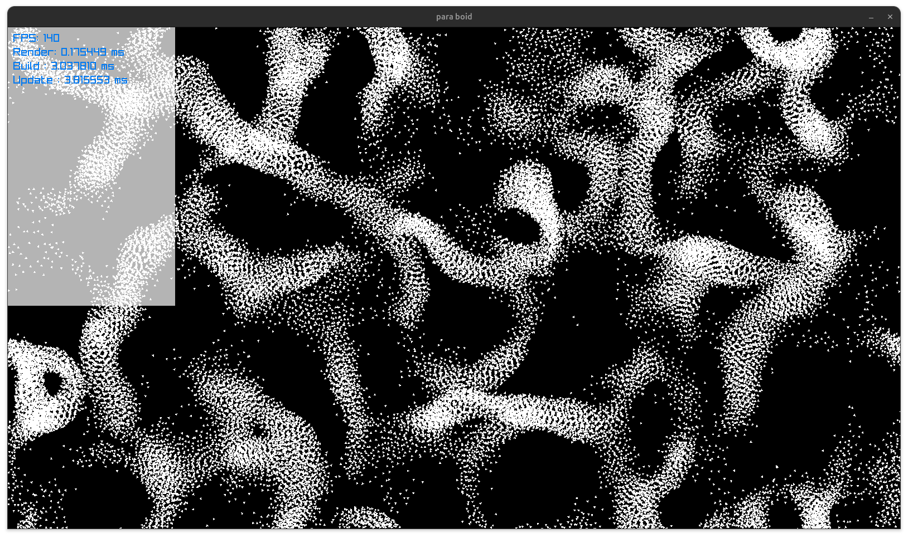
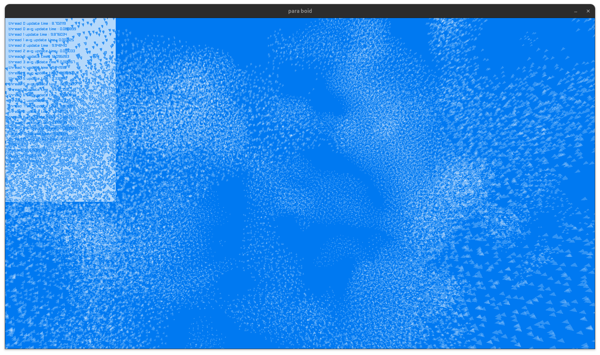

# para-boids


A boids (flocking) simulation used as a playground for multi-threading and SIMD in C.

The real goal isn't the boids themselves — it's using them as a concrete, visual workload
to experiment with writing multi-threaded-by-default programs, in the spirit of
Casey Muratori and Ryan Fleury's article on multi-threading by default. The simulation
is split into per-thread "lanes" from the start (not bolted on after the fact), synchronized
with a hand-rolled sense-reversing barrier, with each thread working out of its own
arena carved from a single reserved block of virtual memory.

SIMD is the next layer being explored on top of that: restructuring the boid/grid data
so the per-boid neighbor search can be vectorized, instead of just relying on
thread-level parallelism alone.

## Status

The data layout work needed for SIMD is done: boid positions/velocities live in flat
SoA arrays, the spatial grid is a contiguous CSR-style layout instead of a pointer-chased
linked list, and the grid rebuild physically sorts the boid data into cell order (double
buffered) so a cell's neighbors are a contiguous run in memory rather than a gather.

Before writing the actual vectorized code, the frame is instrumented with a per-phase
timer (render / grid build / update, each shown on screen in milliseconds) so any SIMD
work can be measured against a real baseline instead of guessed at:


The neighbor search inside `update()` is now AVX2-vectorized: for each boid, the
grid's per-cell boid runs (already contiguous thanks to the sorted layout above) are
scanned 8-at-a-time, with the three cells in a grid row merged into a single range
before vectorizing, since they're contiguous by construction. Per-thread update time
dropped from ~24-28ms to ~5ms with this in place, at a boid count that's also grown
from 20k to 50k in the process:


One follow-up experiment on that neighbor search: instead of vectorizing each of the
three per-row cell ranges separately, the three ranges were first gathered with `memcpy`
into one contiguous per-boid scratch buffer (pulled from the thread's arena, reset every
boid), so the SIMD loop could run over the merged range in a single pass instead of three.
Measured against the plain per-row loop, it was slower — ~100 FPS versus 124-144 FPS for
the three-iteration version, since the `memcpy`s and per-boid arena churn cost more than
merging the three SIMD calls saved. That version is kept behind `#ifdef ARENA_VECTORIZED`
in `update()` (disabled by default) as a reference for why the simpler three-iteration
loop won out.

Rendering was the next bottleneck: drawing each boid individually (one `DrawRectangle`/
`DrawPixel` call per boid) was CPU-bound on draw-call overhead, not GPU work, and had
grown larger than the vectorized update itself. It's replaced with a single GPU-instanced
draw built directly on `rlgl` (one triangle mesh, one per-instance `(x, y, vx, vy)` buffer,
a custom vertex shader doing the rotation from the direction vector), which also makes it
straightforward to render each boid as a triangle oriented in its direction of travel
instead of a plain point. Render time dropped from ~11ms to under 1ms:



The simulation was then migrated from 2D to 3D. On the physics/SIMD side this meant
switching every `Vector2` to `Vector3` (positions, velocities, separation/alignment/
cohesion accumulators), adding a `z`/`vz` lane throughout the SoA and the AVX2 neighbor
search, and extending the spatial grid with a third axis (`GRID_W × GRID_H × GRID_Z`,
CSR bucketing keyed on `x,y,z`, and the per-boid neighbor search now looping `dy` and
`dz` over the surrounding 3×3×3 cells instead of just `dy` over a 1×3 row).

On the rendering side, the flat 2D triangle became an indexed tetrahedron — a small
vertex/index buffer pair loaded once via `rlLoadVertexBuffer`/`rlLoadVertexBufferElement`
and drawn with `rlDrawVertexArrayElementsInstanced`. The per-boid instance data grew from
`(x, y, vx, vy)` packed into a single `vec4` attribute to `(x, y, z)` and `(vx, vy, vz)`
as two separate `vec3` attributes (a GPU vertex attribute caps out at 4 components, so
6 floats needs two slots, not one), and the vertex shader now builds a full 3D orientation
basis from the velocity via `cross()` instead of the old 2D perpendicular trick. The
projection swapped from an orthographic `MatrixOrtho` to `MatrixPerspective` combined with
a `MatrixLookAt` view, with `rlEnableDepthTest()` turned on so overlapping boids actually
occlude by depth instead of by draw order. On top of that sits a simple orbit camera —
yaw/pitch/distance around the fixed world-center target, driven by arrow keys and the
mouse wheel, recomputed into the `mvp` uniform once per frame instead of a fixed matrix
computed once at startup:



The 3D migration also surfaced a flocking-behavior bug rather than a rendering one:
boids would slowly drift into full overlap over time, with no particular concentration
near any edge of the world. `SEPARATION_RADIUS` had carried over unchanged from the 2D
tuning, but a fixed radius covers a much smaller volume relative to `NEIGHBOUR_RADIUS`
in 3D than the same ratio covered in area in 2D (a sphere's volume falls off with radius
far faster than a disc's area does), so separation was consistently losing the tug-of-war
against cohesion/alignment at close range. Retuning `SEPARATION_RADIUS` (10 → 20) and
`SEPARATION_WEIGHT` (8 → 16) for 3D density fixed it.

That tuning fix raises the threshold at which separation kicks in, but the underlying
force is still constant-strength within that radius — each close neighbor contributes a
unit-length push (`(self - other) / dist`), the same magnitude whether it's 19 units away
or 0.1 units away. It doesn't ramp up as two boids approach true coincidence, so it's a
threshold fix, not a self-scaling one: dense enough clusters could still slowly out-run it
the same way. A more robust version would scale the push with proximity — dividing by
`dist` a second time (`(self - other) / dist²`) so separation strengthens sharply at close
range instead of relying purely on the fixed radius/weight ceiling — noted here as the
next lever to pull if tighter flocks or higher boid counts bring the overlap back.

## Layout

- `main.c` — the boids simulation: update/render loop, flocking rules (separation,
  alignment, cohesion), spatial grid for neighbor lookups, and the thread/lane setup.
- `util.c` — the memory allocator: a `Reserve` (a large `mmap`'d virtual address space)
  that hands out page-aligned `Arena` sub-regions, with pages committed lazily as
  objects are actually allocated.
- `thread.c` — early scratch work for a generic threading abstraction, kept around from
  before the lane/barrier design in `main.c` existed.

## Building

```bash
./build.sh
./main
```

Requires [raylib](https://www.raylib.com/) and pthreads.
